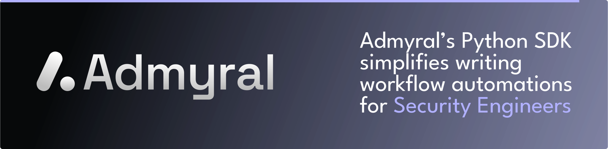

<p align="center">

</p>

<div align="center">
  <div>
      <a href="https://github.com/Admyral-Security/admyral"><strong>Admyral Repository</strong></a> ·
      <a href="https://docs.admyral.dev/"><strong>Docs</strong></a> ·
      <a href="https://discord.gg/GqbJZT9Hbf"><strong>Discord</strong></a>
  </div>
  <div>


  </div>
</div>

# Admyral Quickstart

**Prerequisites**:

- Python 3.12
- Poetry
- Docker

## Getting Started

1. Clone this repository:

```bash
git clone git@github.com:Admyral-Security/admyral-quickstart.git
cd admyral-quickstart
```

2. Install the required Python packages in the admyral-quickstart repo:

```bash
poetry install
```

3. Start Admyral (**Hint**: you can also use `poetry shell` then you can omit `poetry run` in the following commands):

```bash
poetry run admyral up
```

4. Open the Admyral UI by visiting [http://localhost:3000](http://localhost:3000) in your browser.

5. Go to `workflows/analyze_url.py` to check out the workflow defined in code.

6. The workflow uses VirusTotal to analyze a URL. You will need to provide your VirusTotal API key. You can get a free API key by signing up at [VirusTotal](https://www.virustotal.com/) and then store it using the Admyral CLI (Note: replace `your_api_key` with the VirusTotal API key):

```bash
poetry run admyral secret set virustotal_api_key --values api_key=your_api_key
```

7. You can use the `admyral` CLI to push your first workflow:

```bash
poetry run admyral workflow push analyze_url -f workflows/analyze_url.py --activate
```

8. You can now run the workflow from the Admyral UI or using the `admyral` CLI:

```bash
poetry run admyral workflow trigger analyze_url -p '{"url": "https://www.google.com"}'
```

9. You can inspect the steps of the workflow run in the Admyral UI by entering the workflow and then clicking on **Run History**.

## More Examples

You can find more examples [here](https://github.com/Admyral-Security/admyral/tree/main/examples).
